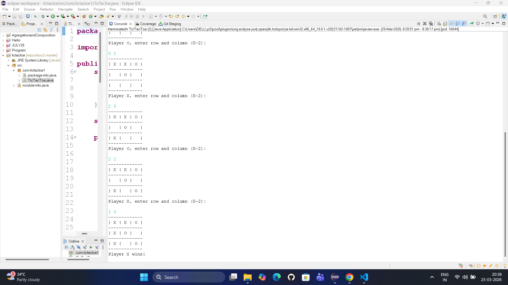
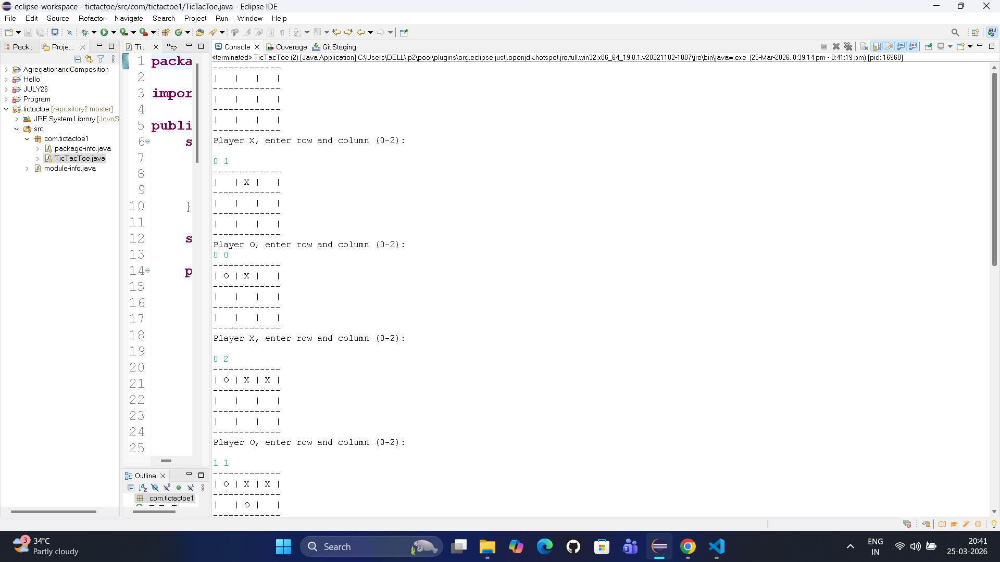
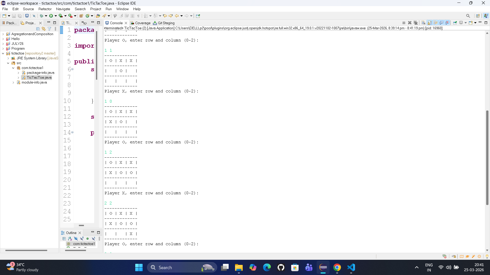
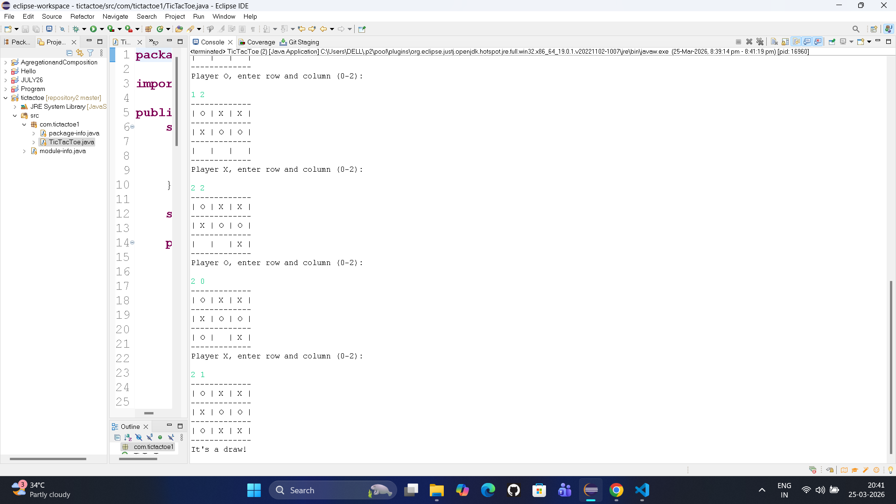
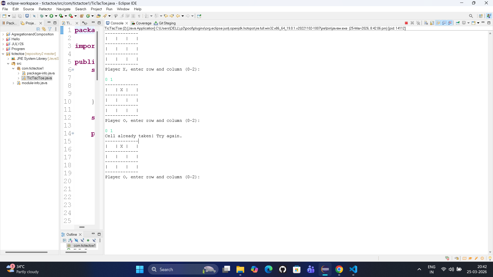

# Tic Tac Toe Game (Java)

## Project Overview
This is a simple Tic Tac Toe game developed using Java. It is a two-player console-based game that allows users to play turn by turn until a winner is decided or the game ends in a draw.

---

## Features
- Two-player gameplay
- Interactive console interface
- Win and draw detection logic
- Clean and structured code

---

## Technologies Used
- Java
- Eclipse IDE

---

## How to Run
1. Clone the repository
2. Open the project in Eclipse
3. Run the main class file

---

## Output

### Player X Wins

### Its Draw

### Cell Already Taken

---

## Project Structure
- `src/` → Java source code
- `.project` → Eclipse configuration
- `.classpath` → Build path settings
